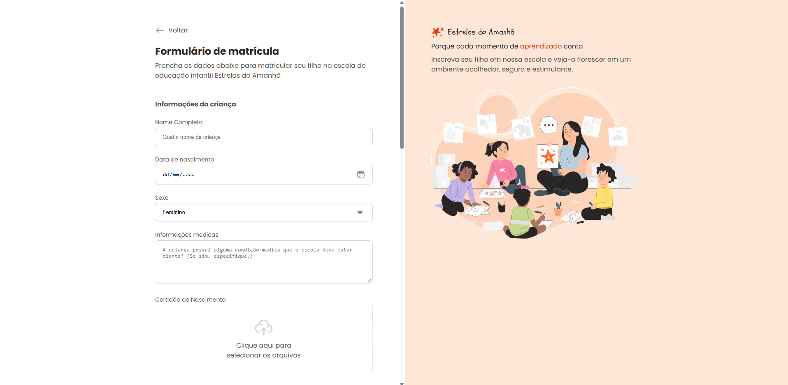

# ​ Registration Form – Tomorrow's Stars

This project is a **school registration form** for registering children at the "Stars of Tomorrow" preschool. Built with a modern front-end focus, it uses advanced HTML5 and CSS3 to provide a clean, intuitive, and visually pleasing experience.

> "This is a Tomorrow's Stars school registration form, developed with advanced HTML5 and CSS3."
> It is ideal for **registration system simulations** in practical front-end teaching contexts. :contentReference[oaicite:1]{index=1}

---


---

## ​ Detailed Description

The page features:

- Clear title and introduction: "Enrollment Form" and initial instructions.
- Well-organized sections for registering the child, guardian, and enrollment options.
- Various fields: text, date, gender selection, document uploads, address (zip code, street, number, city, state), and shift/sports options with visual icons.
- Checkbox for accepting terms and conditions.
- Action buttons such as "Save Responses" and "Enroll."
- Validation messages (e.g., alert if the email address is invalid).
- Footer with institutional slogan and illustrative visual elements. :contentReference[oaicite:2]{index=2}

---

## ​ Project Structure
```
registration-form/
├── assets/ # Recursos visuais como ícones, ilustrações e logo
├── styles/ # Arquivos de estilo CSS (layouts e componentes)
├── index.html # Página principal do formulário
└── .gitignore

```

## Technologies Used

- **HTML5** — semantic markup and accessible forms.
- **CSS3** — modern styling with a focus on usability and visual presentation.
- **Icons and Illustrations** — graphic elements that enrich the interface and facilitate understanding.

---

## ​ Test the Project

You can view the form online:

​ [Access “Stars of Tomorrow” here](https://calbertorodrigues.github.io/registration-form/) :contentReference[oaicite:3]{index=3}

---

## ​ Future Features (Suggestions)

- JavaScript validation for email, zip code, and phone number formats.
- Dynamic visual feedback for uploads (e.g., file name).
- Confirmation modal when submitting the form.

- Development of a backend form (PHP, Node.js, or other technology) to capture and save data.
- Responsiveness for mobile devices.

---

## ​ Instructions for Local Use

1. Clone the repository:
```bash
git clone https://github.com/cAlbertoRodrigues/registration-form.git
cd registration-form
```
2. Open the index.html file in your favorite web browser.

3. Explore the form, test the fields, and enter dummy values for visual evaluation.
